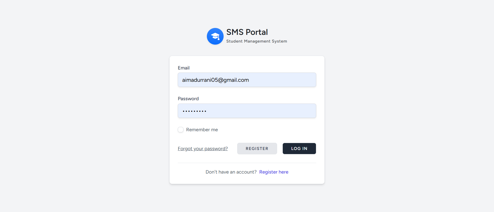
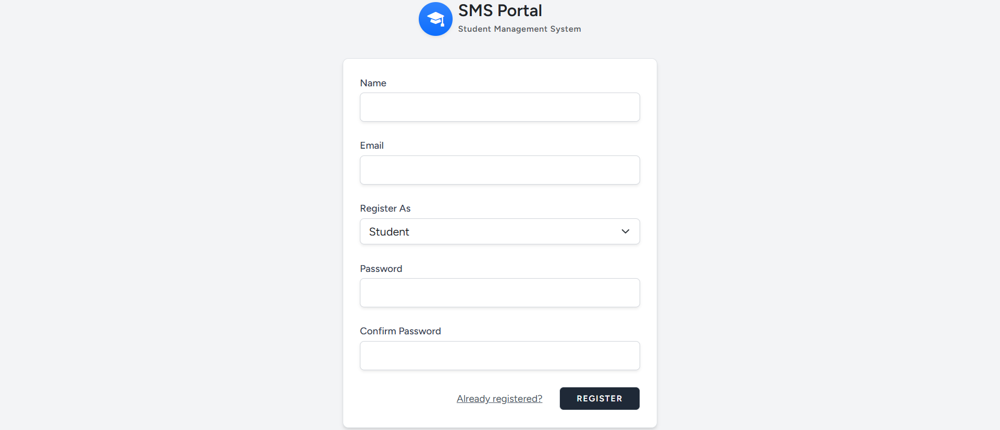
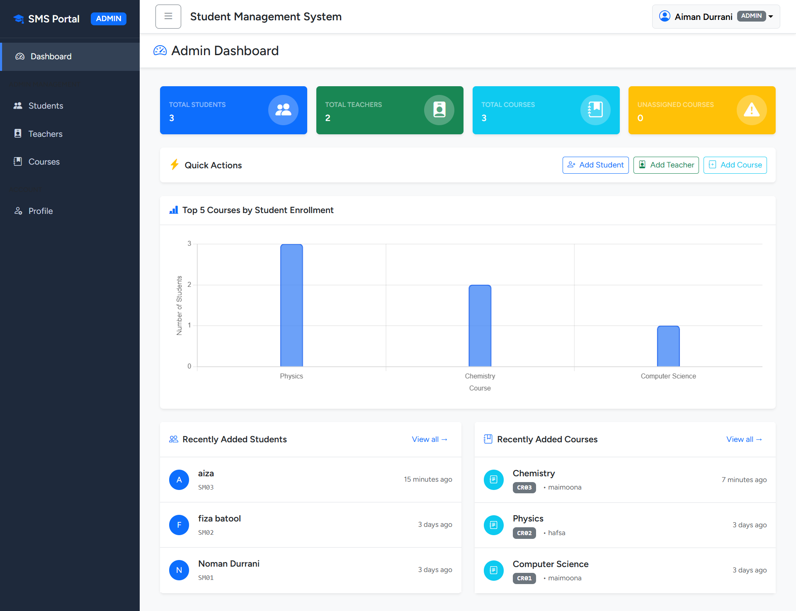
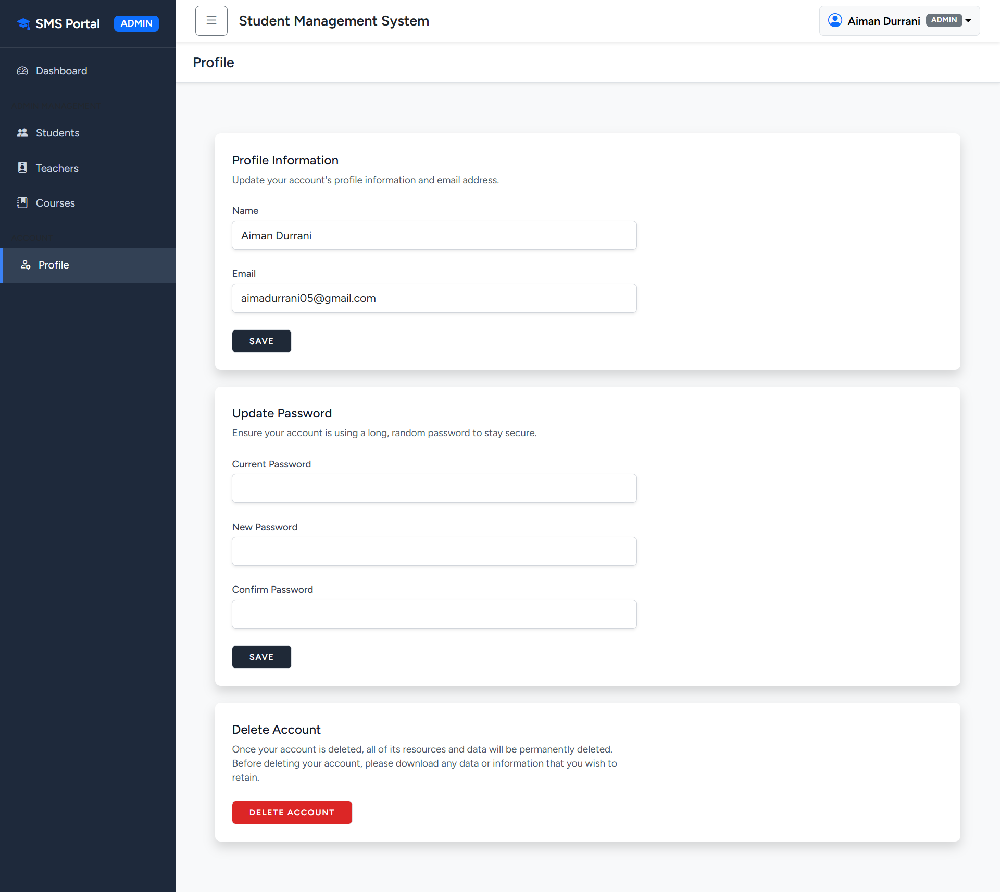
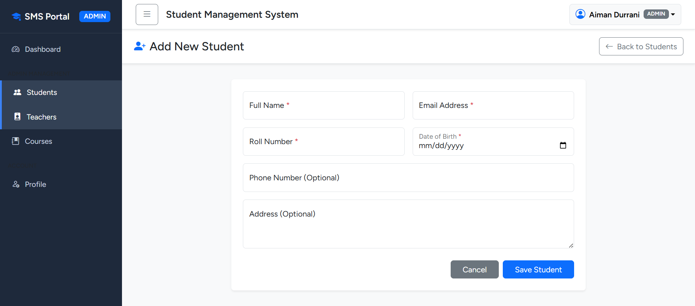
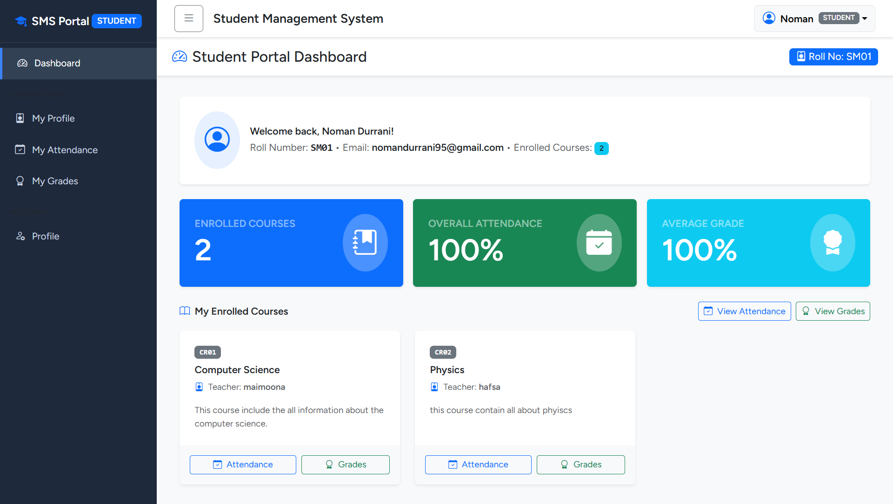
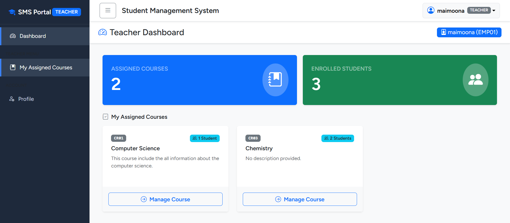
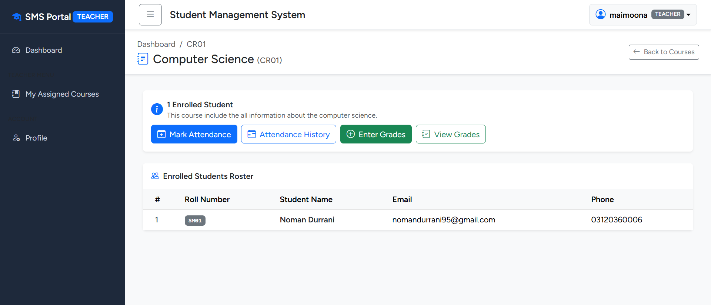
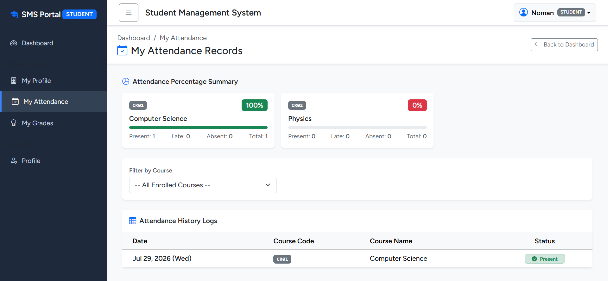
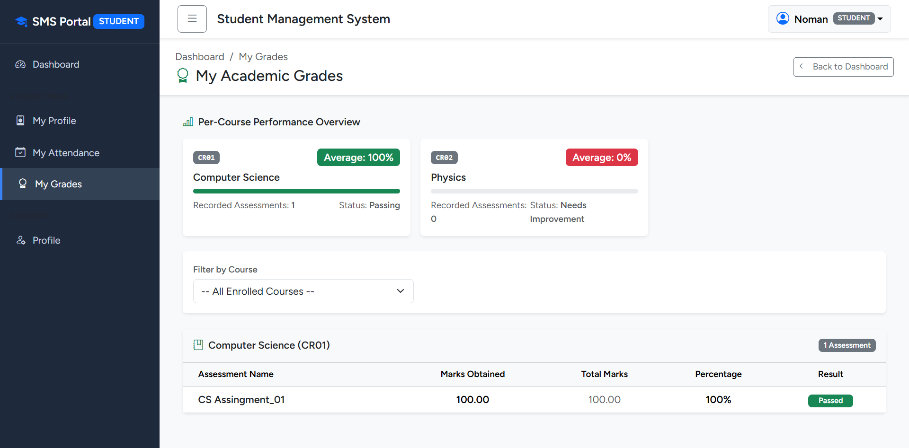

# Student Management System (SMS)

A role-based Student Management System built with **Laravel 11** and **Bootstrap 5**, developed as a hands-on project to learn core Laravel concepts — MVC architecture, routing, Eloquent relationships, migrations, validation, middleware, and Blade templating.

---

## About the Project

This project simulates a real-world school/college management system with three distinct user roles — **Admin**, **Teacher**, and **Student** — each with its own dashboard and permissions. It was built incrementally, starting from authentication and role-based access control, then layering in full CRUD modules, relational data (courses, enrollments), and finally attendance and grading features.

---

## Features

### Admin
- Secure login/registration with role-based access control
- Full CRUD for Students, Teachers, and Courses
- Assign teachers to courses and enroll students (many-to-many)
- Search and pagination on all management tables
- Dashboard with live stats (total students/teachers/courses), a Chart.js bar chart of top courses by enrollment, and recent activity widgets

### Teacher
- Dashboard showing only their own assigned courses
- Mark daily attendance (present / absent / late) per course
- Enter and manage grades per assessment (e.g. Midterm, Assignment 1)
- Attendance breakdown chart per course

### Student
- Read-only dashboard with enrolled courses and quick stats
- View own profile
- View own attendance history with per-course percentage
- View own grades with per-course average and progress bars

### General
- Role-based middleware — every route is protected by both authentication and role
- Flash messages (success/error alerts) on all create/update/delete actions
- Form re-population on validation errors
- Responsive Bootstrap 5 UI across all pages

---

## Tech Stack

| Layer | Technology |
|---|---|
| Backend | Laravel 11 (PHP) |
| Frontend | Blade templates + Bootstrap 5 |
| Database | MySQL |
| Auth | Laravel Breeze |
| Charts | Chart.js |

---

## Database Structure (Simplified)

```
users (id, name, email, password, role)
students (id, user_id, name, email, roll_number, date_of_birth, phone, address)
teachers (id, user_id, name, email, employee_id, subject, phone, address)
courses (id, name, code, teacher_id, description)
course_student (course_id, student_id)      -- enrollment pivot
attendances (id, course_id, student_id, date, status)
grades (id, course_id, student_id, assessment_name, marks_obtained, total_marks)
```

---

## Screenshots

### Auth

| Login Page | Register Page |
|---|---|
|  |  |

### Admin

| Admin Dashboard | Profile Settings |
|---|---|
|  |  |

| Add Student | Students Management |
|---|---|
|  |  |

### Teacher

| Teacher Dashboard | Manage Course |
|---|---|
|  |  |

### Student

| Attendance | Grades |
|---|---|
|  |  |

## Installation

```bash
# Clone the repository
git clone https://github.com/your-username/student-management-system.git
cd student-management-system

# Install PHP dependencies
composer install

# Install JS dependencies
npm install
npm run build

# Environment setup
cp .env.example .env
php artisan key:generate

# Configure your database in .env, then run migrations
php artisan migrate

# (Optional) Seed sample data
php artisan db:seed

# Serve the application
php artisan serve
```

Visit `http://127.0.0.1:8000` — you'll be redirected to the login page.

---

## Roadmap / Possible Future Additions

- [ ] Email notifications for low attendance
- [ ] Export attendance/grades to PDF or Excel
- [ ] Teacher/Student profile editing
- [ ] Admin ability to filter unassigned/empty courses directly from dashboard alerts

---

## License

This project is for personal learning purposes.